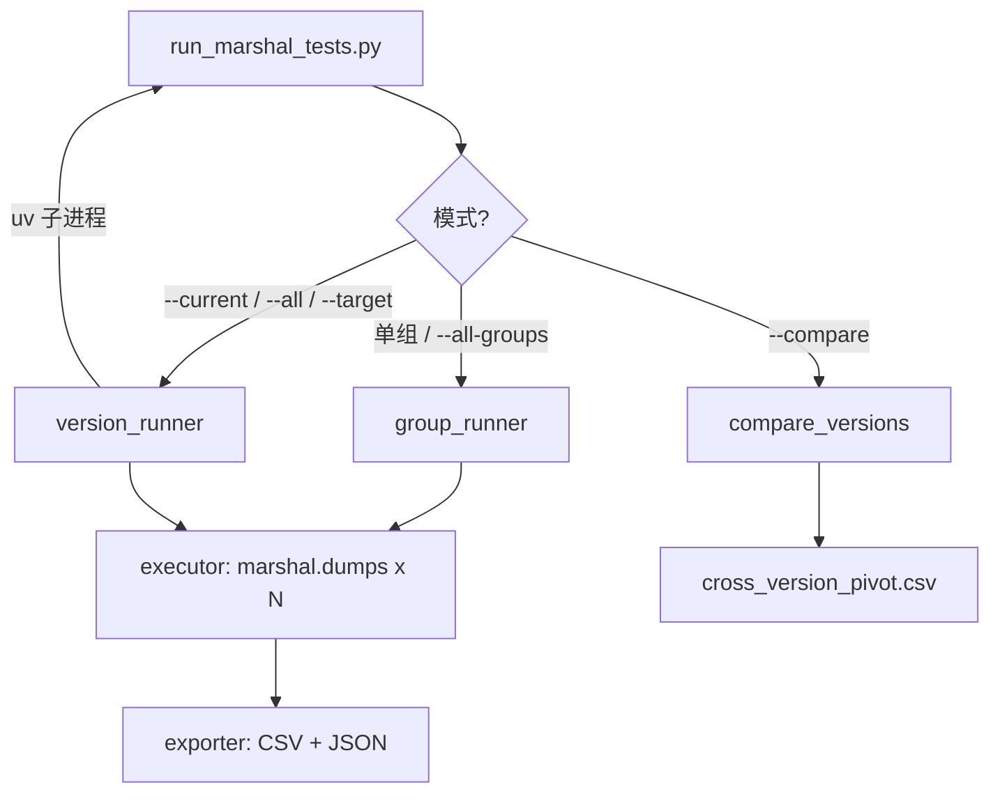

# marshal 序列化稳定性测试

对给定 Python 对象**多次**执行 `marshal.dumps()`，检查序列化结果（SHA-256、字节长度）或异常是否在重复运行中保持一致，并支持在 **Python 3.10–3.14** 之间做跨版本对比。

| 特性 | 说明 |
|------|------|
| 运行方式 | 独立脚本 + [uv](https://docs.astral.sh/uv/) |
| 测试框架 | 不依赖 pytest / unittest |
| CLI 入口 | `run_marshal_tests.py` |
| 用例总数 | **158** 条（6 组） |
| 提交前自检 | `self_check.py` |

---

## 1. 环境准备

**要求**：Python ≥ 3.10，推荐安装 [uv](https://docs.astral.sh/uv/)。

```powershell
cd D:\学习\软件测试\marshal_test

uv --version
uv python list
uv python install 3.10 3.11 3.12 3.13 3.14
uv run python --version
```

可选虚拟环境：

```powershell
uv venv --python 3.14
.venv\Scripts\Activate.ps1
```

激活后可直接 `python run_marshal_tests.py ...`，效果与 `uv run python ...` 相同。

---

## 2. 快速开始

```powershell
# 查看帮助（含全部用例组名）
uv run python run_marshal_tests.py --help

# 提交前自检（编译、注册表、判定逻辑）
uv run python self_check.py

# 单组冒烟（最快）
uv run python run_marshal_tests.py basic --quick

# 当前解释器跑全部 158 条用例
uv run python run_marshal_tests.py --current

# 跨 Python 版本对比（需 uv 已安装对应版本）
uv run python run_marshal_tests.py --all --compare-after
```

---

## 3. 用例组说明

共 **6** 个用例组，注册顺序见 `cases/registry.py` 中的 `CASE_GROUP_ORDER`。

| 组名 | 数据文件 | 条数 | ID 前缀 | 说明 |
|------|----------|------|---------|------|
| `basic` | `cases/basic.py` | 33 | `BASIC-` | None、数值、字符串、bytes、float、单例等 |
| `container` | `cases/container.py` | 31 | `CONTAINER-` | list / tuple / dict / set / slice 等 |
| `complexity` | `cases/complexity.py` | 34 | `COMPLEXITY-` | 深层嵌套、大容器、共享引用等 |
| `code` | `cases/code.py` | 22 | `CODE-` | 函数、闭包、生成器、控制流等 Code 对象 |
| `nested` | `cases/structure.py` | 24 | `NEST-` | 混合嵌套、深层边界、大对象等 |
| `cycle` | `cases/structure.py` | 14 | `CYCLE-` | 自引用、互引用、循环图等 |

辅助构造函数在 `cases/builders.py`（如 `make_nested_list`）。

---

## 4. 命令速查

### 4.1 按用例组运行

```powershell
uv run python run_marshal_tests.py basic
uv run python run_marshal_tests.py container
uv run python run_marshal_tests.py complexity
uv run python run_marshal_tests.py code
uv run python run_marshal_tests.py nested
uv run python run_marshal_tests.py cycle
uv run python run_marshal_tests.py --all-groups
```

| 命令 | 结果文件示例 |
|------|----------------|
| 单组 | `results/{prefix}_results_时间戳.csv` / `.json` |
| `--all-groups` | 每组各一份（前缀见上表对应组的 `result_prefix`） |

单组结果前缀：`basic_type`、`container_type`、`complexity`、`code`、`nested`、`cycle`。

### 4.2 全量 / 跨版本

| 命令 | 说明 |
|------|------|
| `--current` | 当前解释器跑全部用例 → `results/python_versions/` |
| `--single` | 同 `--current` |
| `--all` | uv 依次跑 3.10–3.14，生成 summary + 各版本结果 |
| `--target 3.13 3.14` | 只跑指定版本 |
| `--current --version-label PY-05` | 指定结果中的版本标签 |

> **易混提示**
>
> - `--all` = 跨 **Python 版本**（3.10–3.14）
> - `--all-groups` = 跑 **全部 6 类用例**（`basic` → `container` → `complexity` → `code` → `nested` → `cycle`）
> - **不能**同时写 `basic` 与 `--current` / `--all` / `--target`
> - `--all` 时子进程输出会**实时显示**在终端

### 4.3 重复次数、过滤、对比

| 选项 / 环境变量 | 说明 |
|-----------------|------|
| `--quick` | 每用例只跑 1 次 |
| `--repeat N` | 指定重复次数（≥1），覆盖组默认 |
| `MARSHAL_TEST_REPEAT` | 普通组默认重复次数（默认 **10**） |
| `MARSHAL_HEAVY_REPEAT` | 重量级组默认重复（默认 **1**） |
| `MARSHAL_COMPLEXITY_REPEAT` | 同 `MARSHAL_HEAVY_REPEAT`（兼容旧名） |
| `--only BASIC-01,NEST-01` | 只跑列出的用例 ID（逗号分隔，不区分大小写） |
| `--filter slice` | 只跑 ID 或名称包含该文本的用例 |
| `--compare` | 根据已有版本 CSV 生成 pivot 表 |
| `--compare-after` | `--all` / `--target` 结束后自动生成 pivot |

**重量级组**（默认 repeat=1）：`complexity`、`nested`、`cycle`。

示例：

```powershell
uv run python run_marshal_tests.py basic --quick
uv run python run_marshal_tests.py complexity
uv run python run_marshal_tests.py code --quick --only CODE-01
uv run python run_marshal_tests.py nested --quick --only NEST-01
uv run python run_marshal_tests.py cycle --quick --only CYCLE-01
uv run python run_marshal_tests.py container --filter slice --quick
uv run python run_marshal_tests.py --all-groups --quick
uv run python run_marshal_tests.py --current --only BASIC-01,CONTAINER-01 --quick
uv run python run_marshal_tests.py --all --compare-after
uv run python run_marshal_tests.py --compare
```

### 4.4 手动指定 Python 版本（可选）

```powershell
uv run --python 3.10 python run_marshal_tests.py --current --version-label PY-01
uv run --python 3.14 python run_marshal_tests.py --current --version-label PY-05
```

### 4.5 查看 / 清理结果

```powershell
dir results
dir results\python_versions
Remove-Item -Recurse -Force results
```

---

## 5. Python 版本标签

版本映射在 `config.py` 的 `VERSION_TARGETS` 中定义，可按需修改。

| 标签 | Python |
|------|--------|
| PY-01 | 3.10 |
| PY-02 | 3.11 |
| PY-03 | 3.12 |
| PY-04 | 3.13 |
| PY-05 | 3.14 |

不同版本间 SHA-256 不一致通常表示 **marshal 版本或实现差异**，不一定是程序缺陷。

---

## 6. 结果说明

### 6.1 输出位置

| 运行方式 | 路径 |
|----------|------|
| 单组 | `results/{prefix}_results_时间戳.csv` / `.json` |
| `--current` / 单版本全量 | `results/python_versions/marshal_python_{版本}_{标签}_时间戳.*` |
| `--all` / `--target` | 另含 `python_version_summary_时间戳.*` |
| `--compare` | `results/python_versions/cross_version_pivot_时间戳.csv` |

### 6.2 终端 Summary

每组或 `--current` 结束后会打印：

```txt
STABLE_SUCCESS / STABLE_EXCEPTION / UNSTABLE 数量
status -> SUCCESS / EXCEPTION / UNSTABLE
```

### 6.3 CSV 字段（单组）

| 字段 | 含义 |
|------|------|
| `test_id` | 如 `BASIC-01` |
| `test_name` | 用例说明 |
| `input_repr` | 输入的简短 repr（过长会截断） |
| `status` | `SUCCESS` / `EXCEPTION` / `UNSTABLE` |
| `final_result` | 稳定性判定（见下表） |
| `repeat_count` | 重复次数 |
| `success_runs` / `exception_runs` | 成功 / 异常次数 |
| `unique_sha256_count` | 成功时不同哈希个数 |
| `sha256` / `size` | 稳定成功时 |
| `exception_type` / `exception_message` | 稳定异常时 |

版本对比 CSV 额外包含：`version_label`、`case_group`。

> CSV **不含**每行环境信息；完整环境在 JSON 顶层 `environment` 中。

### 6.4 JSON 结构

```json
{
  "environment": {
    "python_version": "3.14.5",
    "marshal_version": 5,
    "machine": "...",
    "platform": "...",
    "run_time": "..."
  },
  "results": []
}
```

### 6.5 final_result 判定

| 值 | 含义 |
|----|------|
| `STABLE_SUCCESS` | 全部成功且 SHA-256 一致 |
| `STABLE_EXCEPTION` | 全部失败且异常类型一致 |
| `UNSTABLE_HASH` | 全部成功但哈希不一致 |
| `UNSTABLE_EXCEPTION` | 全部失败但异常类型不一致 |
| `UNSTABLE_MIXED` | 成功与失败混合 |

### 6.6 跨版本 summary 字段

| 字段 | 含义 |
|------|------|
| `version_label` | PY-01 … PY-05 |
| `target_python_version` | 如 3.10 |
| `run_status` | DONE / FAILED / SKIPPED |
| `result_files` | 本次生成的结果文件 |
| `error_message` | 失败或跳过原因 |

### 6.7 跨版本 pivot（`--compare`）

`compare_versions.py` 会读取 `results/python_versions/marshal_python_*.csv`，按 `version_label` 取最新一份，生成 `cross_version_pivot_*.csv`，包含各版本的 `status`、`final_result`、`sha256` 及 `hash_consistent_across_versions` 列。

---

## 7. 项目结构

```txt
marshal_test/
├── config.py                 # 路径、版本表、RunOptions、重复次数
├── run_marshal_tests.py      # 唯一 CLI 入口
├── self_check.py             # 提交前自检
├── cases/
│   ├── __init__.py           # 导出 CASE_GROUPS、collect_all_version_cases 等
│   ├── registry.py           # 用例组注册（_CASE_SPECS、CASE_GROUP_ORDER）
│   ├── basic.py
│   ├── container.py
│   ├── complexity.py
│   ├── code.py
│   ├── structure.py          # nested + cycle
│   └── builders.py
├── core/
│   ├── executor.py           # marshal.dumps + 稳定性判定
│   ├── exporter.py           # CSV / JSON 导出
│   ├── group_runner.py       # 单组运行 + 终端汇总
│   ├── version_runner.py     # 跨版本调度（uv 子进程）
│   └── compare_versions.py   # 跨版本 pivot 表
├── results/                  # 自动生成（.gitignore）
├── pyproject.toml
└── README.md
```

### 7.1 模块职责

| 模块 | 职责 |
|------|------|
| `cases/*.py` | 仅定义测试数据，不执行、不导出 |
| `cases/registry.py` | 注册用例组、汇总全量用例 |
| `core/executor.py` | 单次/多次 `marshal.dumps` 与 `final_result` 判定 |
| `core/group_runner.py` | 单组运行、打印、调用导出 |
| `core/version_runner.py` | `--current` / `--all` / `--target` |
| `core/exporter.py` | 写入 `results/` |
| `core/compare_versions.py` | 生成跨版本 pivot |

### 7.2 新增 / 修改用例

1. 在 `cases/` 对应文件中添加 `(test_id, test_name, value)` 元组。
2. 新组需在 `cases/registry.py` 的 `_CASE_SPECS` 中注册。
3. 若组内用例较大或耗时长，可将组名加入 `config.py` 的 `HEAVY_CASE_GROUPS`。
4. 运行自检确认无重复 ID：

```powershell
uv run python self_check.py
```

`self_check.py` 会检查：全部 `.py` 可编译、目录完整、`cases/` 文件清单、158 条用例与 ID 唯一性、判定与过滤逻辑。

---

## 8. 推荐流程

**首次使用**

```powershell
uv python install 3.10 3.11 3.12 3.13 3.14
uv run python self_check.py
uv run python run_marshal_tests.py basic --quick
uv run python run_marshal_tests.py --all-groups --quick
uv run python run_marshal_tests.py --all --compare-after
```

**日常调试**

```powershell
uv run python self_check.py
uv run python run_marshal_tests.py basic --quick --only BASIC-01
uv run python run_marshal_tests.py --current --quick --only NEST-01
```

**正式交作业 / 交结果**

```powershell
Remove-Item -Recurse -Force results
uv run python self_check.py
uv run python run_marshal_tests.py --all --compare-after
```

将 `results/` 目录中的 CSV、JSON 打包提交（该目录已在 `.gitignore` 中忽略）。

---

## 9. 常见问题

| 现象 | 处理 |
|------|------|
| Excel 中 `3.10` 显示为 `3.1` | 将该列设为文本，或查看 JSON |
| 某版本 `SKIPPED` | `uv python install 3.xx` 后重试 |
| `complexity` / `nested` / `cycle` 很慢 | 重量级组默认 repeat=1；调试加 `--quick` |
| `NEST-15` 出现 `RecursionError` | 超过 marshal 递归深度限制，属预期异常用例 |
| `CYCLE-*` 在部分版本失败 | 循环引用序列化行为因版本而异，重点看 `final_result` 是否稳定 |
| slice 在 3.10–3.13 异常、3.14 成功 | marshal 格式 v5 差异，属预期对比结果 |
| `--compare` 无输出 | 需先有 `results/python_versions/marshal_python_*.csv` |
| `不能同时指定用例组` | 版本模式（`--current` 等）与 `basic` 等组名互斥 |

---

## 10. 运行逻辑简图


